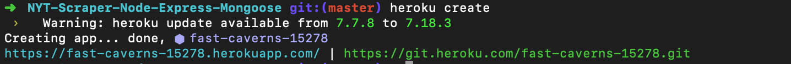
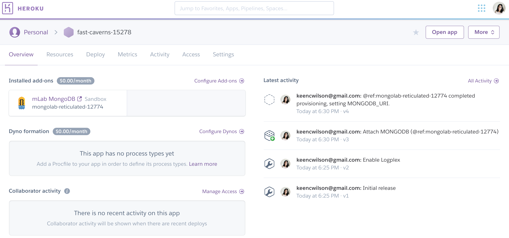

# NYT-Scraper-Node-Express-Mongoose

A web app utilizes `mongoDB`, `Mongoose`, `cheerio`, and `express` to let the user scrape articles from a website.

---

A working version of the application can be found at [https://fast-caverns-15278.herokuapp.com/](https://fast-caverns-15278.herokuapp.com/ "NYT-Scraper-Node-Express-Mongoose")

---

## Dependencies

- `express`
- `express-handlebars`
- `mongoose`
- `cheerio`
- `axios`

## What This Application Does

- Whenever a user visits the site, the user can use a scraping tool to scrape stories from a news outlet, which is **The New York TImes** in this app. The user can select which section of NYT that they want to review: `Business`, `technology`, `food`, `travel`, and `style`.
- Each scraped article will be saved to the application database.
- The app should scrape and display the following information for each article:
  - Headline - the title of the article
  - Summary - a short summary of the article
  - URL - the url to the original article
  - imagePath - the image url of the original article

* Users are able to leave comments on the articles displayed and revisit them later. The comments will be saved to the database as well and associated with their articles. Users will also be able to delete comments left on articles. All stored comments will be visible to every user.

---

## Deploy Your Project To Heroku

1. On your local machine, navigate to your project folder. As this point, we’ll assume you’ve been pushing/pulling your code with Github but have yet to deploy it to Heroku
2. Run `heroku create` to connect your repo with Heroku
   

3. Run this command in your Terminal/Bash window:

   `heroku addons:create mongolab`

   This command will add the free mLab provision to your project.

4. When you go to connect your mongo database to mongoose, do so the following way:

   ```js
   // If deployed, use the deployed database. Otherwise use the local mongoHeadlines database
   var MONGODB_URI =
     process.env.MONGODB_URI || "mongodb://localhost/mongoHeadlines";

   mongoose.connect(MONGODB_URI);
   ```

   - This code should connect mongoose to your remote mongolab database if deployed, but otherwise will connect to the local mongoHeadlines database on your computer.

5. Navigate to heroku.com and login with your credentials

6. Find your Heroku app’s name in the dashboard. Click on it. You'll know that Heroku set up your database when a mLab MondoDB entry shows up in the Add-ons section.
   

7. To deploy your app to Heroku, you typically use the git push command to push the code from your local repository’s master branch to your heroku remote, like so: `git push heroku master`

---

## Express Generator

Use the application generator tool, [express-generator](https://expressjs.com/en/starter/generator.html), to quickly create an application skeleton.

- The express-generator package installs the express command-line tool. Use the following command to do so: `npm install express-generator -g`

- For example, the following creates an Express app named myapp. The app will be created in a folder named myapp in the current working directory and the view engine will be set to `handlebars`: `express --view=hbs myapp`

- Or you can use `express-generator` insdie a current working directory: `express --view=hbs`. Then install dependencies: `npm install`

* Then load http://localhost:3000/ in your browser to access the app.

* The generated app has the following directory structure:

```
.
├── app.js
├── bin
│   └── www
├── package.json
├── public
│   ├── images
│   ├── javascripts
│   └── stylesheets
│       └── style.css
├── routes
│   ├── index.js
│   └── users.js
└── views
    ├── error.hbs
    ├── index.hbs
    └── layout.hbs

7 directories, 9 files
```

---

## Helpful Links

- [MongoDB Documentation](https://docs.mongodb.com/manual/)
- [Mongoose Documentation](http://mongoosejs.com/docs/api.html)
- [Cheerio Documentation](https://github.com/cheeriojs/cheerio)
